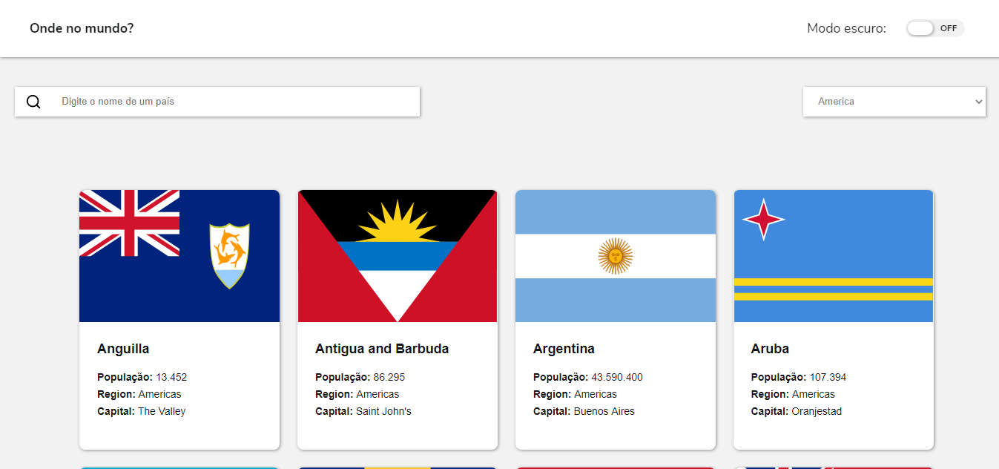
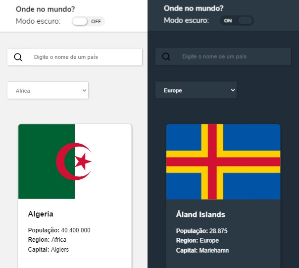
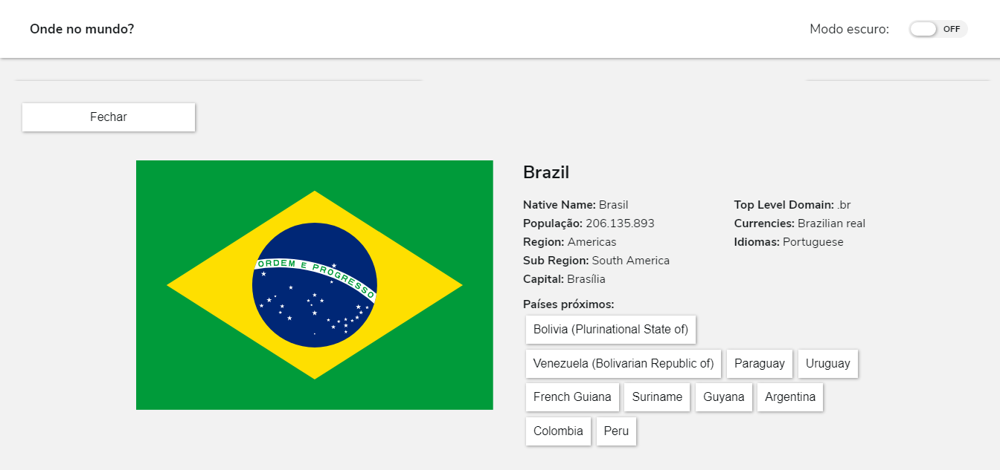

<h1 align="center">Countries API</h1>

Uma página de busca web feita a partir de um desafio do site Frontend Mentor, onde foi dado do design e informações sobre as funcionalidades. A página recebe dados de uma API REST, chamada <em>restcountries.eu</em>, e com parte dos dados fornecidos, é feito a renderização de uma prévia dos países com o nome mais semelhante ao pesquisado, ou dos países de uma determinada região.

 

<h1 align="center">Design fornecido</h1>
<h1 align="center"></h1>
 

<h1 align="center">Design feito</h1>
<h1 align="center"></h1>
 

<h1 align="center">Tema escuro</h1>

O tema escuro foi implementado alterando apenas as variáveis criadas em CSS, salvando as configurações localmente.

<h1 align="center"></h1>
 

<h1 align="center">Detalhes</h1>

A página detalhes, mostra mais detalhes sobre os países, mostrando coisas como a moeda, idioma e países próximo ao país selecionado.

<h1 align="center"></h1>
 

Outras informações:
- Cada input (text e select), passa por uma simples validação, que impede valores nulos ou inválidos.
- As páginas são limitadas por cinco países por vez, para não poluir a tela quando feita uma pesquisa com muitos resultados.
- Além de integrar com uma API REST, a página foi estilizada com Sass, para fins de aprendizado.

 
